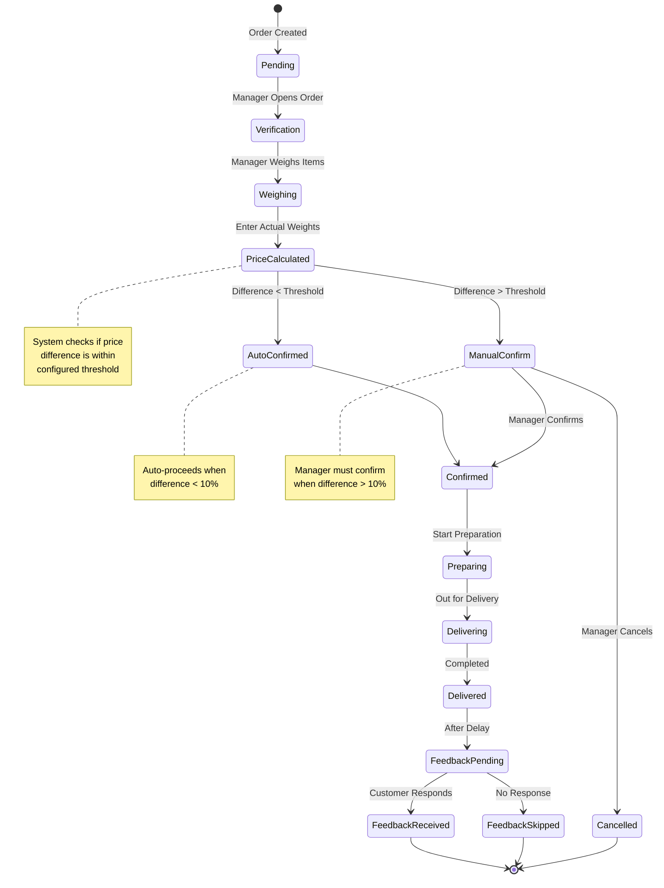

# Manager/Admin Flow Diagram

## Order Processing - Admin Panel & Notifications


## Verification Screen Detail

```mermaid
flowchart LR
    subgraph Verification Table
        direction TB
        Header[Order #123 - Verification]
        
        subgraph Items
            Item1["`**Salmon Fillet**
            Expected: 1.0 kg | Actual: [0.95]
            Price: 500 грн → 475 грн`"]
            
            Item2["`**Shrimp Large**
            Expected: 0.5 kg | Actual: [0.48]
            Price: 300 грн → 288 грн`"]
            
            Item3["`**Caviar Red**
            Expected: 100 g | Actual: [100]
            Price: 800 грн → 800 грн`"]
        end
        
        Total["`**Total**
        Expected: 1600 грн
        Actual: 1563 грн
        Difference: -37 грн (-2.3%)`"]
        
        Buttons[Confirm Order | Cancel Order]
    end
```

## Admin Configuration Flow


## Real-time Notification Sequence


## Order Status State Machine

