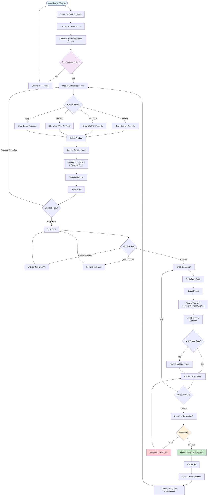
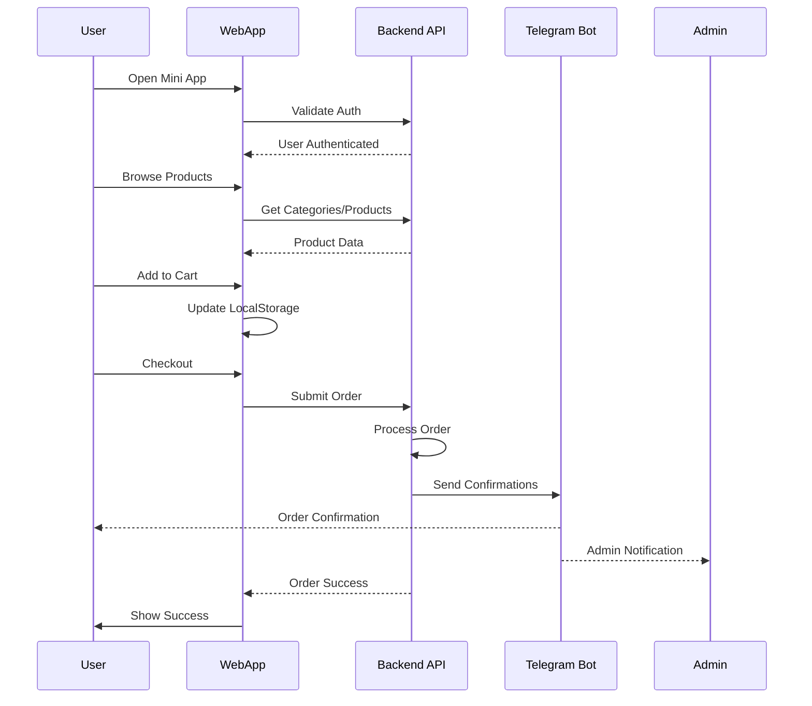

# User Flow Diagram

## Customer Journey - Seafood Store Mini App

## Key User Interactions

### Navigation Flow
- **Linear progression**: Categories → Products → Details → Cart → Checkout
- **Back navigation**: Telegram back button available at any step
- **Cart access**: Cart icon visible on all screens except loading/cart

### Decision Points
1. **Product Selection**: Browse multiple categories and products
2. **Package Choice**: Select appropriate weight/size
3. **Cart Management**: Continue shopping vs checkout
4. **Promo Code**: Optional discount application
5. **Order Confirmation**: Final review before submission

### Error Recovery
- **Auth failures**: Redirect to start
- **API errors**: Show message, allow retry
- **Validation errors**: Highlight fields, prevent submission

### Success Path
1. Browse → Select → Add to Cart → Checkout → Confirm → Success
2. Minimum steps: 7 (direct path)
3. Average steps: 10-12 (with browsing)

## Data Flow

